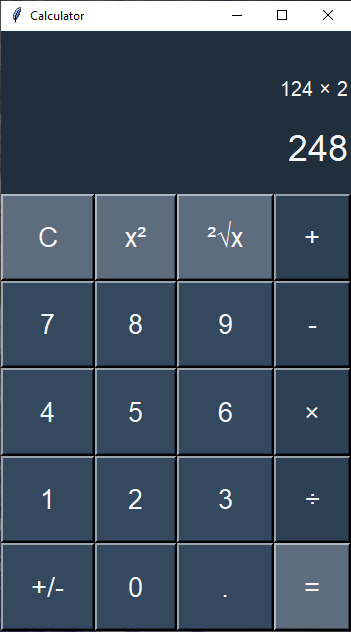

# Calculator
This is a custom made calculator. It has been build with Python using the GUI library Tkinter. Its functionalities include square root, square and more basic ones like multiplication, division, subtraction, etc.

# Preview

  

